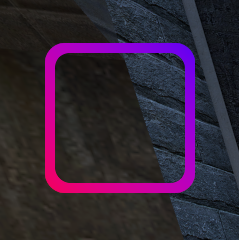

# esclib.masks

### Usage

```lua
local masks = esclib.masks
--... In some draw context:
masks.Start()
    masks.DrawBlur(pnl) --requires panel or manually set x,y .DrawBlur(x,y)
    --Content
    draw.RoundedBox(0,0,0,w,h,Color(255,0,0))
masks.Source()
    --Mask
    draw.RoundedBox(0,0,0,w,h,color_white)
masks.End()
```

### Complex masking

<figure><figcaption><p>Cut example</p></figcaption></figure>

```lua
local masks = esclib.masks
--... In some draw context:
masks.Start()
    surface.SetDrawColor(255, 0, 0)
    surface.DrawRect(50, 50, 150, 150)
    surface.SetDrawColor(0, 0, 255)
    surface.SetMaterial(melon.Material("vgui/gradient-r"))
    surface.DrawTexturedRectRotated(50 + (150 / 2), 50 + (150 / 2), 300, 300, 45)

masks.Source()
    draw.RoundedBox(20, 50, 50, 150, 150, color_white)
masks.And(masks.KIND_CUT)
    draw.RoundedBox(20 - 5, 50 + 10, 50 + 10, 150 - 20, 150 - 20, color_white)
masks.End(masks.KIND_STAMP)
```
